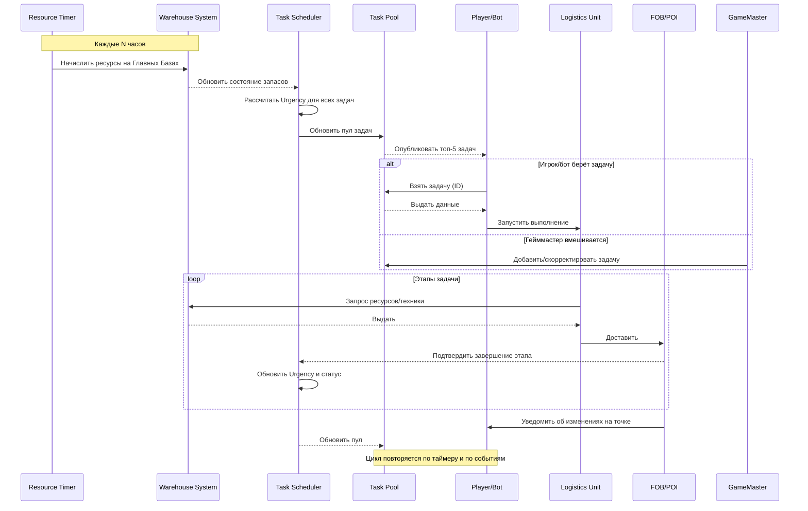

## Концепт PvE-сервера DCS

### 1. Общая структура

* **Театр операций**: карта «Сирия».
* **Стороны**:

  * Союзники (игроки + боты) — *Sustainment Force*.
  * RED Force (противник) — полностью ИИ, управляется гейммастером.
* **Персистентность**:

  * Используется встроенный warehouse DCS для хранения ресурсов.
  * Состояние баз и ФОРПов сохраняется между сессиями.
  * Ресурсы генерируются по таймеру (например, каждые 6 часов).

### 2. Ресурсы и склады

| Ресурс          | Хранится в          | Используется для            | Единица учёта    |
| --------------- | ------------------- | --------------------------- | ---------------- |
| Боеприпасы      | Главные Базы, ФОРПы | Спавн юнитов, авиаудары     | штуки (шт.)      |
| Топливо         | Главные Базы, ФОРПы | Полёты ВС, движение конвоев | литры (л)        |
| Медикиты/Запасы | Главные Базы, ФОРПы | Восстановление живой силы   | упаковки (уп.)   |
| Запчасти        | Главные Базы        | Ремонт техники              | комплекты (ком.) |

* **Главные Базы**: 3–5 крупных аэродромов/узлов в тылу.
* **ФОРПы** (Forward Operating Resupply Points): мобильные точки ближе к фронту.

> **Пояснение**: ФОРПы создаются и переносятся по мере продвижения линии фронта, сохраняя накопленные ресурсы.

### 3. Логистическая цепочка (Sustainment Flow)

1. **Начисление ресурсов**: каждые N часов (например, 6 ч) на Главных Базах пополняются запасы (руководство FM 4-0 «Sustainment»).
2. **Перевозка в ФОРПы**: задания игрокам/ботам — конвой из Главной Базы → ФОРП.

   * Транспорт: C‑130, CH‑47, UH‑60, грузовики, бронетехника, БПЛА-заправщики.
3. **Распределение на фронт**: ФОРПы автоматически выдают ресурсы ближайшим захваченным точкам.

   * При истощении запасов ниже порога падает «готовность» юнитов: меньше выстрелов, дольше ремонт.

> **Пояснение**: Коэффициент «потерь» при транспортировке зависит от расстояния и активности RED Force по маршруту.

### 4. Механика захвата и расхода ресурсов

* **Захват POI**: юниты/игроки удерживают точку заданное время (FM 3‑90 «Tactics»).
* **Расход**:

  * Спавн подразделения (AI/игрок) «стоит» X боеприпасов и Y литров топлива.
  * Авиаудары/артподдержка расходуют дополнительные ресурсы.
  * Чем дальше POI от ФОРПа — выше коэффициент транспортных потерь.

### 5. Роли и специализации

1. **Логисты-пилоты** (C‑130, CH‑47): крупные поставки.
2. **Наземные конвои** (бронетехника, грузовики): доставка до ФОРПов и POI.
3. **БПЛА-разведчики**: сканирование маршрутов, поиск угроз.
4. **Эскорты-штурмовики**: прикрытие конвоев, подавление ПВО.
5. **Медэвак**: эвакуация раненых (игроки/боты).

> **Пояснение**: Каждый игрок/бот может выбрать роль и переключаться между этапами цепочки.

### 6. Генерация и приоритизация задач

#### 6.1. Типы задач

* Транспорт ресурсов (боеприпасы, топливо).
* Конвои техники.
* Разведка (БПЛА, юниты).
* Оборона/удар (авио/артподдержка).

#### 6.2. Модель Urgency Index (FM 4-0)

```
Urgency = (Required_Flow_Rate - Current_Supply_Rate) × Criticality_Factor
```

* **Required\_Flow\_Rate** и **Current\_Supply\_Rate** — доли от максимальной потребности и фактического запаса.
* **Criticality\_Factor** (1.0–1.5) зависит от важности точки на фронте.

#### 6.3. Пример расчёта

* **ФОРП Alpha**: 20% топлива (требуется 70%), Crit=1.2 → Urgency=(0.7-0.2)×1.2=0.6.
* **POI Bravo**: 5% боеприпасов (требуется 50%), Crit=1.5 → Urgency=(0.5-0.05)×1.5=0.675 (приоритетнее).

> **Пояснение**: Система формирует единый пул, сортирует по Urgency и выводит топ‑5 задач в HMI.

### 7. Гейммастер и экстренные события

* ГМ может добавлять «аварийные» задачи (эвакуация VIP, ввод сил RED).
* Управляет ИИ RED Force: усиливает ПВО, создаёт засадные зоны.
* Корректирует Criticality для специальных сценариев.

### 8. UI/UX и визуализация

* **Карта командования**:

  * Иконки баз/ФОРПов/POI с индикацией запасов (зелёный/жёлтый/красный).
* **Список задач**: Urgency, дедлайн, тип.
* **Журнал миссий**: логи доставок, событий, приказов ГМ.
* **Радиоканал логистики**: авто-уведомления о дефицитах.

---

## 9. Конвои тяжёлой техники

### 9.1. Состав и объём

* Техника: БМП/БТР, танки, САУ, ПЗРК-ПВО.
* Размер: до 10 ед. техники (оптимально для тралов и C‑130/C‑17).

### 9.2. Многомодальные этапы

1. Наземная подача на базу отправления.
2. Воздушная перевозка (C‑130/C‑17).
3. Наземная доставка от аэродрома до ФОРП/POI.

> **Пояснение**: Каждую стадию можно брать отдельно — гибкость распределения задач.

### 9.3. Спавн и развёртывание

* На ФОРП/POI техника спавнится сразу «готовой к бою».
* Индикатор «в развёрнутом состоянии» до завершения всех этапов.

### 9.4. Эскорт (опционально)

* Игроки могут сопровождать конвой (штурмовики, БПЛА, бронемашины).
* Без эскорта конвой движется медленнее (–10% скорости) и возможны задержки.

### 9.5. Приоритет задач конвоев

```
Urgency_tech = (Required_Tech - Current_Tech) × Criticality_Factor_tech
```

* Авто-повышение Urgency при дефиците (<20% техники) на фронте.

### 9.6. Расписание

* Регулярные конвои: каждые N часов (рекомендуем N=6).
* Экстренные: при Urgency\_tech ≥ 0.8 создаётся аварийная задача.

---

## 10. Общий миссионный цикл (UML Sequence)


